# Probabilistic Deep Learning from Scratch: VAE with PyTorch

This project is the main practical component of my Mathematics Bachelor's Thesis titled **"Probabilistic Machine Learning. The Variational Autoencoder"**, for which I received a **10/10 grade and the highest honors**. It marked a turning point in my ML journey from theory to practice, being my first serious programming project and the one that sparked my deep interest in applied machine learning and PyTorch.

The code implements a Variational Autoencoder (VAE) from scratch using PyTorch and explores its power through several applications across different datasets and domains.

VAEs are powerful generative models that learn a probabilistic representation of data in a latent space parametrized by a neural network, the encoder. That latent space then is connected to the decoder, a neural network that maps from the latent space back to the original data dimension.

  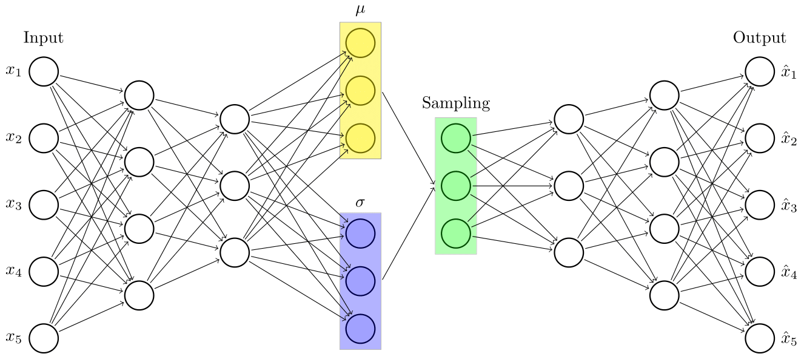

*Figure 1: VAE architecture. The latent space has $q(\textbf{z}|\textbf{x}) = \mathcal{N}(\boldsymbol{\mu}, \boldsymbol{\sigma}\mathbf{I})$ as variational distribution*. Figure made with TikZ.

The connections between the encoder and decoder are learned through a statistical method called reparameterization trick, allowing backpropagation through the stochastic latent space. The VAE is trained to maximize the Evidence Lower Bound (ELBO), which balances reconstruction accuracy and latent space regularization. This is based on the Variational Inference framework, a method of approximate bayesian inference that approximates the true posterior distribution of latent variables given observed data $p(\textbf{z}|\textbf{x})$.

This deep and probabilistic arquitecture allows VAEs to connect a probabilistic latent space whose distribution is under our control with the data space, usually high-dimensional and complex, enabling powerful applications in generative modeling and data manipulation.

  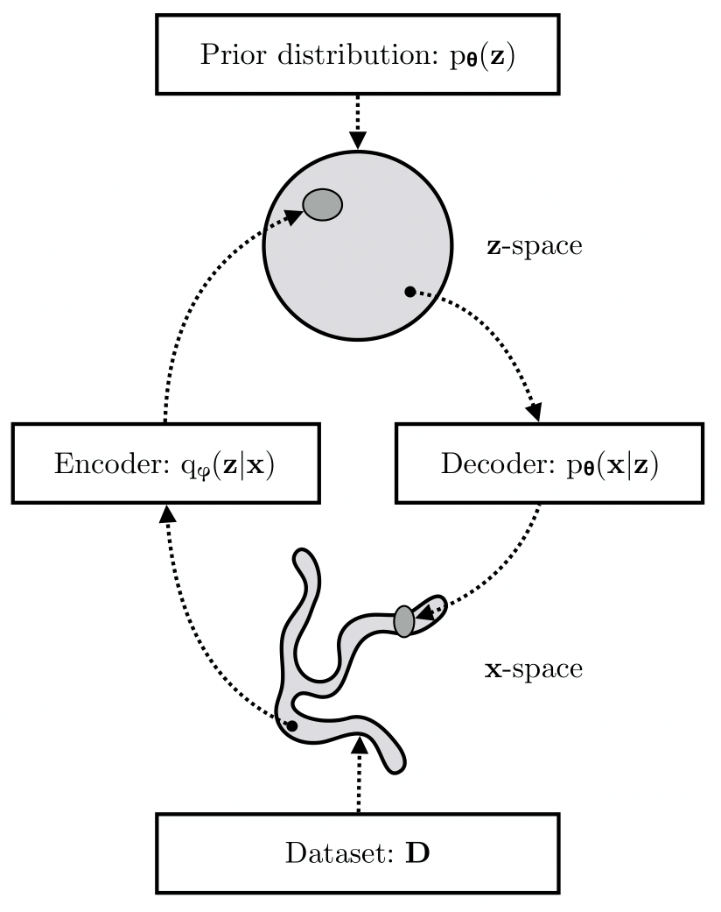

*Figure 2: The VAE connects the data space with the latent space $\textbf{z}$, allowing us to manipulate and generate new data points in the data space from the latent space*. Figure extracted from *[An Introduction to Variational Autoencoders](https://doi.org/10.1561/2200000056)*.

To learn more about Variational Inference, VAEs, and the reparameterization trick, I recommend reading [My Bachelor's Thesis](./bachelors_thesis.pdf), available in English in this repository. I honestly believe it is a great introduction to the topic, as it covers the theory in a clear and intuitive way, with a final focus on practical applications and implementations.

## 📚 Contents

This repository includes:

* `src/`:
    - The main PyTorch code for the VAE implementation, including the model architecture, training loop and evaluation metrics.
    - Dedicated training scripts for CelebA application to increase training speed and performance.
    - Utilities for data loading, preprocessing, and visualization.

* `outputs/`:
    - Results and visualizations of the VAE applications.
    - Images and figures used in the thesis.

* `notebooks/`:
    - Jupyter notebooks with interactive visualizations and analyses of the VAE applications.

* `tests/`:
    - Unit tests for the VAE model and its training to ensure code correctness and robustness.

* `appendix/`:
    - Python scripts versions of the applications presented in the notebooks used in the thesis appendices.

* `data/`:
    - Downloaded datasets used in the project, including MNIST, CelebA, and Brain MRI scans. Ignored by `.gitignore` to avoid large files in the repository.

* `weights/`:
    - Pre-trained model weights for the VAE applications, allowing quick loading and testing without retraining. Ignored by `.gitignore` to avoid large files in the repository.

The full model was trained and tested using an NVIDIA RTX 4070 GPU with cuda 12.6 and PyTorch 2.6.0.

The project uses `pyproject.toml` to manage dependencies and packaging needed.

## 🧪 Applications

### 1. **Generative Modeling and Latent Space Exploration**

- Trained a 2D-latent space VAE on the MNIST dataset to understand the structure of handwritten digits.
- Visualized how digits cluster and transition in the latent space.
- Generated smooth interpolations between classes.

  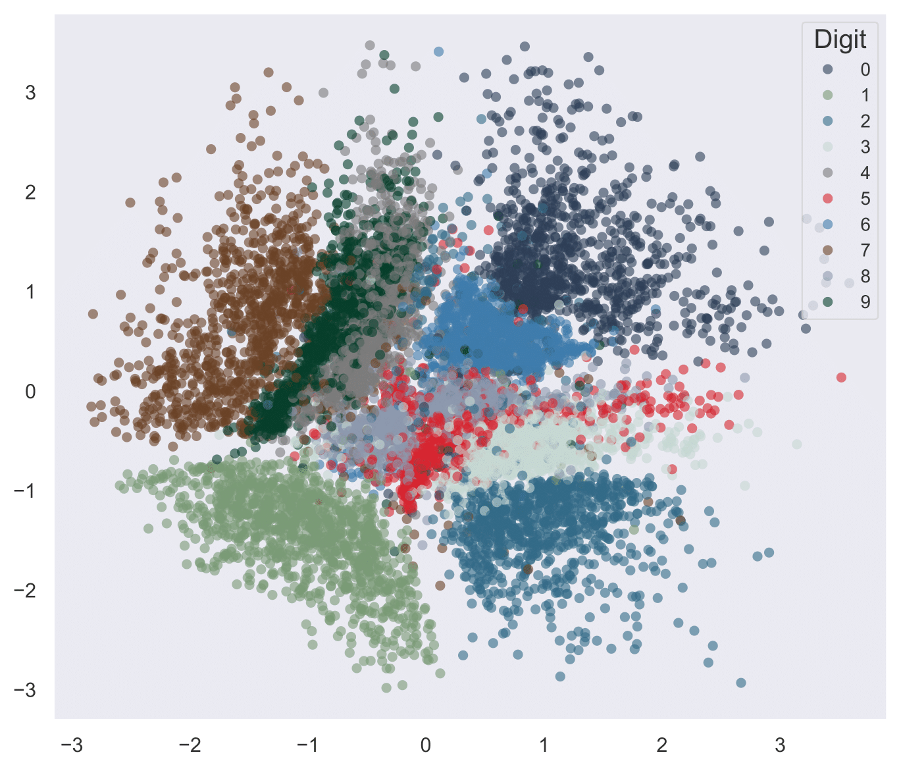
  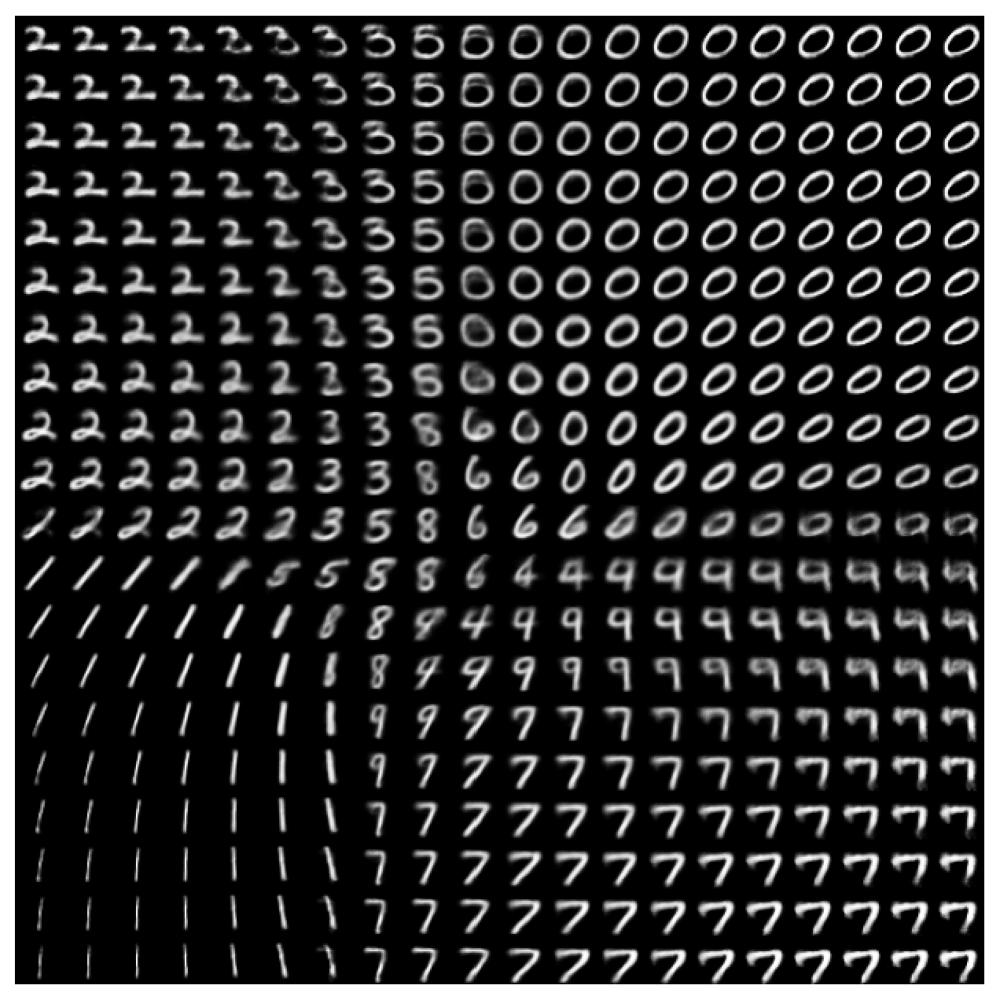

*Figure 3: Left: Latent space of MNIST digits, showing clusters of similar digits. Right: Manifold of MNIST digits, illustrating smooth transitions between classes.*

In this images we can see how the VAE learns a meaningful latent space where similar digits are close together, allowing us to explore and generate new digits by sampling from the latent space and going through the decoder. 

The continuous nature of the latent space allows us to generate new digits by interpolating between existing ones, creating smooth transitions between different digits.

### 2. **Image Denoising and Inpainting**

This is an application that can be done by standard Autoencoders if trained with corrupted data. However, without being explicitly trained on corrupted data, the VAE reconstructs noisy or incomplete digits, leveraging its robust and probabilistic latent representation.

  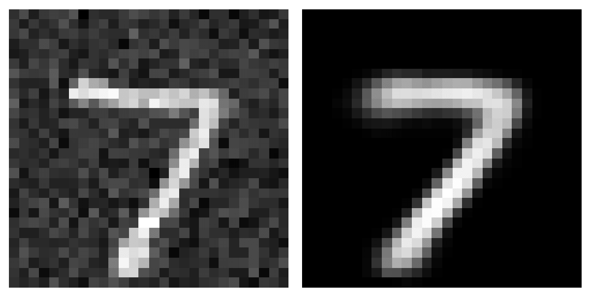
  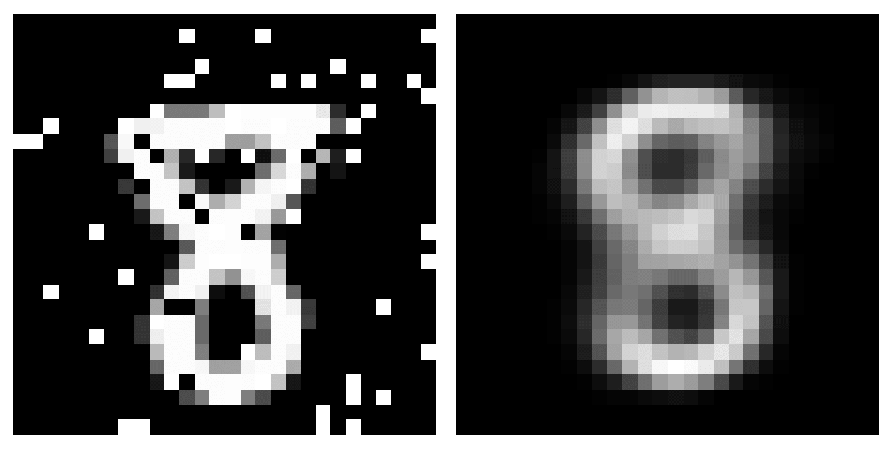

*Figure 4: Left: Denoising MNIST digits by reconstructing noisy inputs. Right: Inpainting MNIST digits by reconstructing missing parts.*

### 3. **Anomaly Detection on Brain MRIs**

- Trained the VAE only on healthy brain MRIs. The latent space learned a normal distribution of healthy brain structures.
- Used reconstruction error to localize tumors or anomalies in new images.
- Created reconstruction error heatmaps to visually highlight the areas of deviation.

  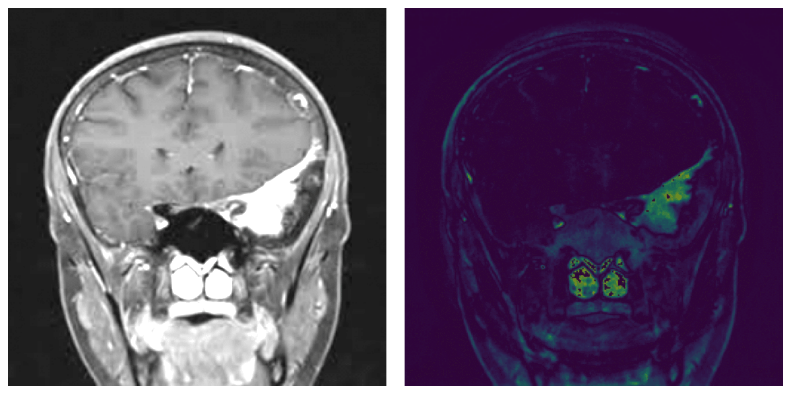
  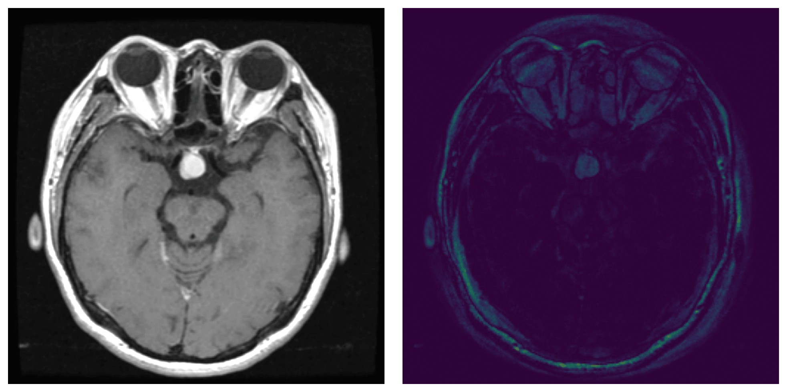

*Figure 5: Left: Meningioma tumor detection. Right: Pituitary tumor detection.*

  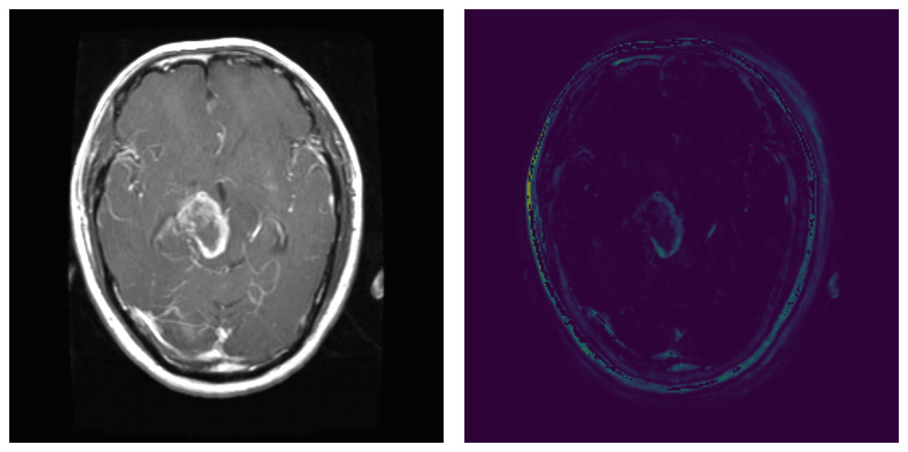
  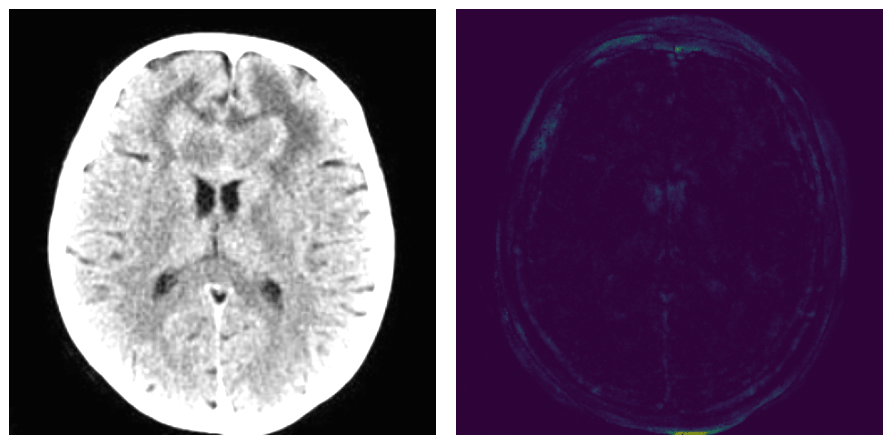

*Figure 6: Left: Glioma tumor detection. Right: Healthy brain MRI with no tumor.*

This application demonstrates the VAE's ability to learn a normal distribution of healthy brain structures, allowing it to detect anomalies by identifying deviations from this learned distribution. The reconstruction error heatmaps provide a visual representation of the areas where the model detects significant differences, failing to reconstruct these areas in the input image accurately.

### 4. **Latent Space Manipulation (CelebA)**

A Variational Autoencoder (VAE) was trained on the CelebA dataset (~200k celebrity face images) to explore **semantic manipulation** in the latent space. Although reconstructions are inherently blurry due to the Gaussian prior, the VAE learns a structured 256-dimensional space where high-level attributes (like *smiling*, *beard*, *glasses*, *age*, or *gender*) can be modified through simple linear operations.

  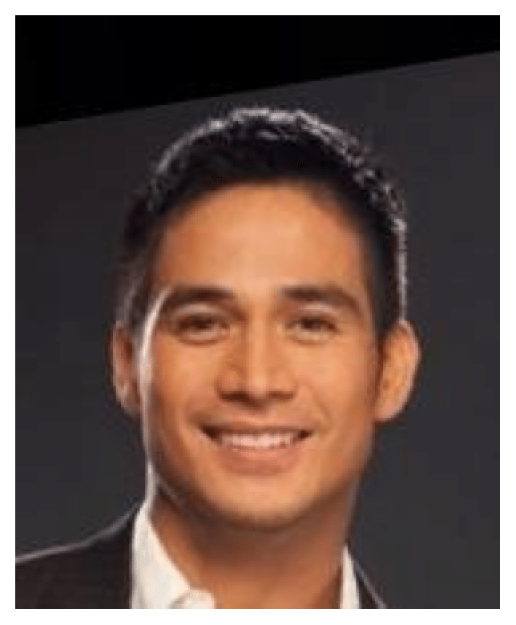
  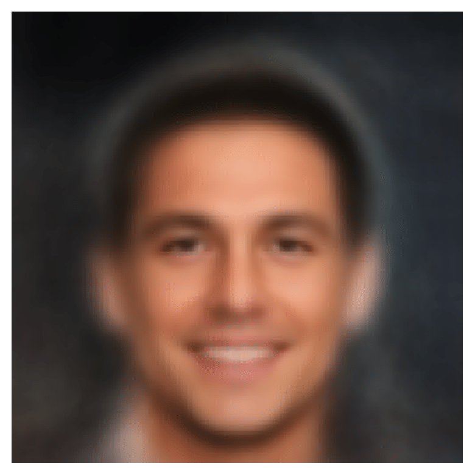

*Figure 7: Image from the test set (left) and its reconstructed version by the trained VAE (right).*

This reconstruction illustrates how VAEs have generative limitations in more complex tasks compared to diffusion models. However, VAEs remain valuable tools and even complements of diffusion models for controlled editing, thanks to their efficiency and interpretable latent representations to learn semantic structures.

For example, by calculating the difference between the latent means of smiling and non-smiling images, a vector $\mathbf{z}_{\text{smile}}$ is obtained. Given the latent representation $\textbf{z}$ of an image that has passed through the encoder, if a controlled translation $\textbf{z}^* = \textbf{z} + \alpha\textbf{z}_{\text{smile}}$ is applied, it allows adding ($\alpha > 0$) or removing ($\alpha < 0$) its smile. By modifying the latent encoding and computing the result through the decoder, the desired result will be obtained applied to the image. The next Figure shows some modifications applied to the evaluation example previously shown.

  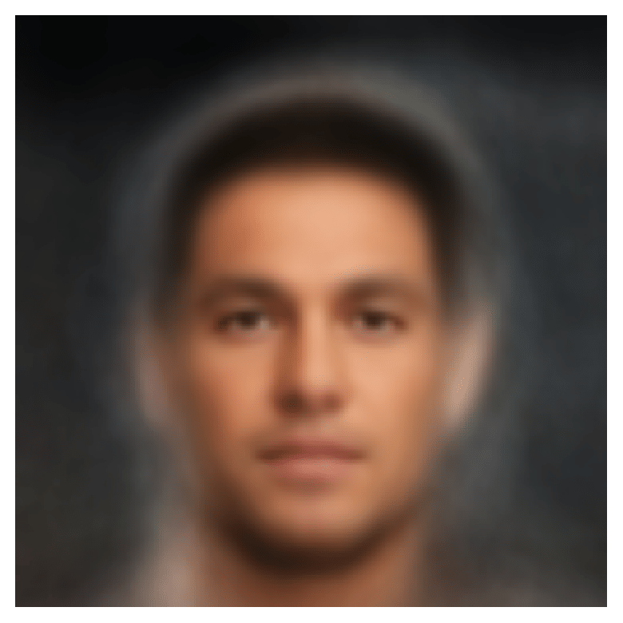
  
  

    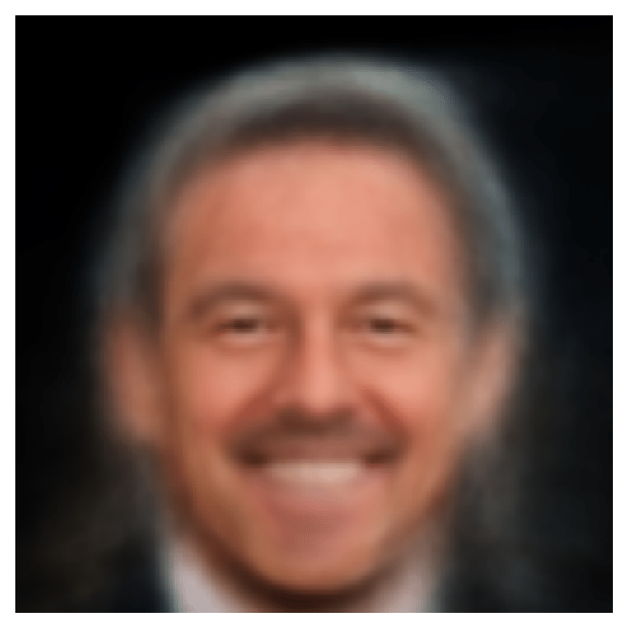
    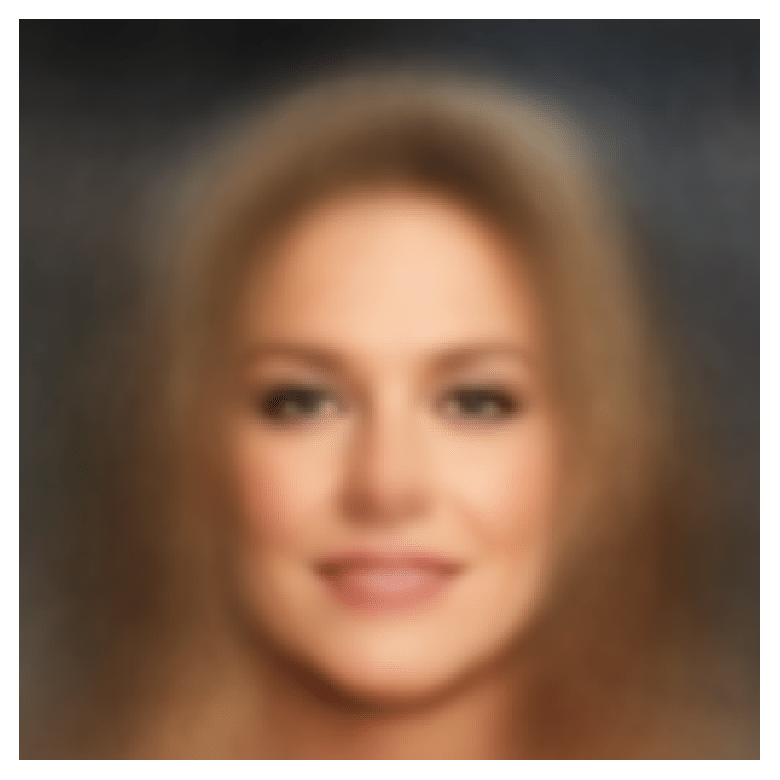

*Figure 8: Results of latent space manipulation applied on the same test image.* 

These results illustrate how VAEs, despite their generative limitations compared to diffusion models, remain valuable tools for controlled facial editing, thanks to their efficiency and interpretable latent representations.

🔗 Try the interactive demo here: [huggingface.co/spaces/angelramos/vae-celeba-manipulation](https://huggingface.co/spaces/angelramos/vae-celeba-manipulation)

*Refer to the `notebooks/` folder for concrete details on applications and the model architecture used in each case.*

## 📖 References

- Blei, D. M., Kucukelbir, A., & McAuliffe, J. D. (2017). *[Variational Inference: A Review for Statisticians](https://doi.org/10.1080/01621459.2017.1285773)*. Journal of the American Statistical Association, 112(518), 859–877.

- Higgins, I., Matthey, L., Pal, A., et al. (2017). *[β-VAE: Learning Basic Visual Concepts with a Constrained Variational Framework](https://openreview.net/forum?id=Sy2fzU9gl)*. International Conference on Learning Representations (ICLR).

- Kingma, D. P., & Ba, J. (2015). *[Adam: A Method for Stochastic Optimization](https://arxiv.org/abs/1412.6980)*. 3rd International Conference on Learning Representations (ICLR).

- Kingma, D. P., & Welling, M. (2014). *[Auto-Encoding Variational Bayes](https://arxiv.org/abs/1312.6114)*. 2nd International Conference on Learning Representations (ICLR).

- Kingma, D. P., & Welling, M. (2019). *[An Introduction to Variational Autoencoders](https://doi.org/10.1561/2200000056)*. Foundations and Trends in Machine Learning, 12(4), 307–392.

- LeCun, Y., Bottou, L., Bengio, Y., & Haffner, P. (1998). *[Gradient-Based Learning Applied to Document Recognition](https://ieeexplore.ieee.org/document/726791)*. Proceedings of the IEEE, 86(11), 2278–2324.

- Liu, Z., Luo, P., Wang, X., & Tang, X. (2015). *[Deep Learning Face Attributes in the Wild](https://openaccess.thecvf.com/content_iccv_2015/html/Liu_Deep_Learning_Face_ICCV_2015_paper.html)*. In Proceedings of the IEEE International Conference on Computer Vision (ICCV), 3730–3738.

- Nickparvar, M. (2024). *[Brain Tumor MRI Dataset (Version 2)](https://doi.org/10.34740/KAGGLE/DSV/2645886)*. Kaggle. DOI: [10.34740/KAGGLE/DSV/2645886](https://doi.org/10.34740/KAGGLE/DSV/2645886)
